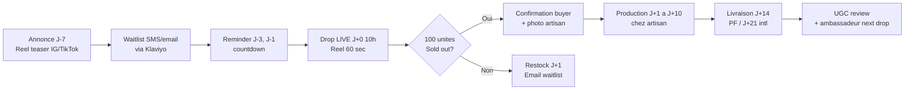
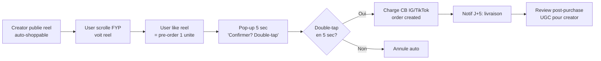

```mermaid
flowchart LR
    A[Senior appelle<br/>40 XX XX XX] --> B[IA: Ia ora na, en reo<br/>tahiti ou francais?]
    B --> C[User decrit besoin<br/>vocal libre]
    C --> D[NLU extrait intent<br/>+ produit + qte + livraison]
    D --> E[IA propose 3 vendeurs<br/>vocal: nom + prix + delai]
    E --> F[User choisit]
    F --> G[IA confirme: paiement?<br/>cash livraison ou virement?]
    G --> H[SMS recap +<br/>vendeur notif]
    H --> I[Vendeur prepare<br/>+ Air Tahiti fret]
    I --> J[Livraison J+3 a J+7]
```

# Innovation Brief — Ebusiness Ecommerce Tahiti

> Genere le 26 avril 2026 par /innovate
> Methodes : First Principles × Cross-Pollination × Future-Back
> Contraintes incompatibles : ZERO acquisition (A) / POLYNESIE UNIQUEMENT (B) / ZERO TEXTE (C)
> 26 idees generees → 13 testees → 4 retenues VALIDATE → 2 MOONSHOT → 4 KILL → 4 PIVOT

---

## Resume Executif

Le marche ecommerce PF est une ruelle ou tout le monde construit le meme Shopify. Les 3 vraies asymetries structurelles inexploitees en 2026 : (1) la **rarete artisanale** mal monetisee (perles, vanille AOP, monoi authentique), (2) les **80K residents** seniors + outer islands totalement coupes du e-commerce textuel, (3) le **trio Reels-First-Voice-First** que les agences locales ne savent pas operer. Trois innovations VALIDATE forment UN seul projet a trois surfaces : **Pacific Drop** (drop calendaire creator-led), **Manu** (voice commerce IA reo tahiti+francais), **Hi'o** (reel = boutique). MVP en 4-6 semaines avec 1 artisan partenaire + 1 creator + 1 numero vocal. Timing : pile bon — Instagram/TikTok Shops API stables, Vapi/Retell matures, ElevenLabs reo tahiti faisable. Concurrence locale : zero. Asymetrie : Shopify ne peut pas penser comme une famille polynesienne, BigTech ne peut pas parler reo tahiti. PACIFIK'AI peut.

---

## Innovations Prioritaires

---

## 1. PACIFIC DROP — Le Drop Calendaire Creator-Led

> 100 unites. 10h. Mardi. Vanille AOP, perle T0+, monoi authentique. Sold out en 30 sec.

### Le probleme
Les artisans PF (vanilliculteurs, perleculteurs, fabricants monoi) produisent du HIGH-VALUE en faible volume (centaines a milliers d'unites/an). Aujourd'hui ils vendent : (a) en gros aux exportateurs avec marge 30-40%, (b) a leur ferme aux touristes chanceux, (c) par bouche-a-oreille via FB. Resultat : sous-monetisation chronique. La diaspora PF (~40K en metropole+NZ+US) ne peut pas acheter. Les touristes repartent sans souvenir authentique.

### La solution
Une plateforme verticale qui orchestre 1 drop par semaine, 1 creator par drop, 1 produit par drop. Format inspire de Pop Mart / Supreme / Pokemon TCG drops. Mardi 10h UTC-10 : drop d'un produit polynesien rare (vanille AOP de Taha'a, perle T0+ de Marutea, monoi cuit sur feu de bois). 100 unites max. Annonce J-7 sur FB+Instagram+TikTok. Live en reel 1 min au moment du drop. Sold out en 30 sec. Livraison 14j (PF) / 21j (international). Paiement PayZen (XPF) ou PayPal (EUR/USD international).

### Pourquoi c'est innovant
- **vs statu quo** : aujourd'hui les artisans PF vendent "en continu" sans marketing → demande basse, prix bas. Le drop cree FOMO + sociabilite + premium pricing (50K XPF perle T0+ vs 30K marche libre).
- **l'insight cle** : la rarete artisanale PF EXISTE deja, elle n'est juste pas MISE EN SCENE. Les acheteurs ne savent pas qu'une perle T0+ est rare. Le drop transforme la rarete en evenement.
- **la source** : Cross-Pollination — luxe streetwear (Supreme, Pop Mart) × artisanat polynesien × FB-first PF.

### Le facteur WOW
"Mardi 10h, Marutea drop 100 perles T0+. J'ai mis l'alarme. J'ai eu la 47eme. C'etait 50K, ca vaut 90K en boutique. Ma femme a pleure quand elle l'a recue 14 jours plus tard, photo de l'eleveur dans la boite."

### Faisabilite
- **Stack** : Shopify (theme custom Pacific Drop) + Klaviyo (waitlist email/SMS) + Meta Pixel + WhatsApp Business API + PayZen (XPF) + PayPal (international) + Cloudflare CDN. Pas besoin de Stripe (workaround supprime).
- **MVP en** : 4-6 semaines (semaine 1-2 : recrutement artisan + setup Shopify + theme drop, semaine 3 : creation contenu drop #1, semaine 4 : warm-up audience, semaine 5 : drop #1 LIVE).
- **Cout MVP** : 800K XPF (~6.7K EUR) — Shopify $79/mois + theme custom 200K + Meta Ads warm-up 300K + production contenu 100K + buffer. **ACN couvre 50% = 400K XPF reel**.
- **Premier test** : 1 partenaire (vanilliculture Taha'a OU perliculture Gambier) + 1 creator polynesien (15K-50K followers IG) + 1 drop test 100 unites + objectif sold-out en <1h.

### Business Model
- **Qui paye** : l'acheteur final (touriste passe + diaspora + collectionneur international + local premium)
- **Combien** : prix produit + marge 30% plateforme (vs Etsy 6.5% + Shopify $79 = 8-9% effectif)
- **Pourquoi ce prix** : on apporte (a) la mise en scene drop = +60% valorisation, (b) l'audience pre-warmee, (c) la logistique. L'artisan recoit 2x ce qu'il aurait recu en gros.
- **Revenue potentiel Y1** : 4 drops/mois × 100 unites × 30K XPF moyen × 30% = 3.6M XPF/mois × 12 = **43M XPF/an** (~360K EUR) avec 1 creator. Avec 5 creators actifs Y2 = 215M XPF (~1.8M EUR).

### Risques & Mitigations
| Risque | Probabilite | Mitigation |
|---|---|---|
| Sold-out impossible (audience pas pre-warmee) | M | Warm-up 4 semaines via Meta Ads + ambassadeur creator |
| Artisan refuse format drop | M | Commencer par 1 artisan deja "creator" (Aspara Tahiti, Manuiti...) |
| Logistique inter-iles defaillante (vanille de Taha'a) | M | Centraliser stock chez l'artisan + Air Tahiti fret |
| Copie par concurrents (Mihimana, Fenua Eco) | L | Speed = avantage, lock-in via creator exclusivites |
| Paiement international friction | M | PayPal + Wise + Revolut acceptes pour international |

### Hypothese Falsifiable
- **Hypothese** : "Si on cree FOMO autour d'un drop calendaire de produit artisanal PF authentique avec 1 creator + 100 unites, alors >70% des unites se vendent dans les 60 premieres minutes du drop, avec >40% de buyers internationaux/diaspora."
- **Protocole de test** (3 etapes, <2 semaines, <200K XPF) :
  1. **J-14 a J-1** : recruter 1 artisan + 1 creator (15K+ followers IG), creer 4 reels teasing (J-7, J-3, J-1, J+0). Budget Meta Ads 100K XPF (warm-up audience PF + diaspora FR/NZ/US).
  2. **J-0 (mardi 10h)** : drop 100 unites via Shopify simple (pas de theme custom). Tracker temps de sold-out + provenance buyers (PF/diaspora/touriste/intl).
  3. **J+7** : analyser. Critere de succes : >70 unites en <60 min OU >40% buyers internationaux.
- **Signal de KILL** : si <40% sold-out OU 0% buyers internationaux apres warm-up correct → format drop pas pertinent pour PF, **PIVOT logique** : passer en commerce social pur (Hi'o, voir #3) sans format drop.

### User Flow

### Prochaine etape CONCRETE
**Lundi 27 avril** : appeler 3 artisans (1 vanille Taha'a, 1 perle Gambier, 1 monoi autochtone) — pitch drop 100 unites + 30% commission + drop #1 vise mardi 10 juin. Identifier celui avec stock + appetit + creator-friendly.

---

## 2. MANU — Voice Commerce IA en Reo Tahiti + Francais

> Tu appelles. Tu parles. Tu recois.

### Le probleme
**80K personnes en PF** sont totalement coupees du e-commerce textuel : (a) seniors 65+ (~50K) qui n'utilisent pas FB Marketplace ni Shopify, (b) habitants outer islands (Tuamotu, Marquises, Australes ~30K) avec internet 2G/3G + analphabetisme fonctionnel partiel, (c) reo-tahiti-monolinguals dans les zones reculees. Pour eux, "ecommerce" est un concept abstrait. Mais ils ont des besoins precis : commander du monoi a un cousin sur une autre ile, faire livrer un cadeau a maman a Tahiti, acheter du materiel agricole a Papeete depuis Rurutu.

### La solution
Un numero de telephone polynesien (40 XX XX XX). Tu appelles. Une IA repond en reo tahiti OU francais (detection automatique ou choix au debut). Tu decris ton besoin a la voix : "ia ora na, je cherche du monoi authentique, 5 bouteilles, pour ma fille a Paris". L'IA propose 3 vendeurs locaux (rang par karma + distance + dispo). Tu choisis. L'IA confirme prix + livraison + paiement (cash on delivery via Air Tahiti fret OU virement BT). Email/SMS recap envoye apres l'appel pour preuve. Toute l'experience est VOCAL, ZERO ecrit. ElevenLabs Reo Tahiti (deja faisable, voir notre projet Reo Tahiti) + Vapi orchestration + Retell IVR.

### Pourquoi c'est innovant
- **vs statu quo** : aujourd'hui ces 80K personnes appellent leur cousin a Papeete qui va au magasin pour eux. Boucle inefficace, pas tracable, pas scalable.
- **l'insight cle** : la VOIX est la seule modalite naturelle pour 80K Polynesiens. Elle est aussi le mode de commerce traditionnel pre-internet (telephoner, demander, recevoir). Le numerique a OUBLIE la voix pendant 20 ans (2005-2025). En 2026, la voix IA est mature.
- **la source** : Future-Back — en 2030 voice-first sera mainstream (Apple Vision, AirPods Pro 4, ambient computing). On commence avec les utilisateurs qui ne sont jamais sortis de la voix.

### Le facteur WOW
"Ma grand-mere de 78 ans a Hiva Oa a commande du materiel pour son jardin a Papeete en parlant a une IA en reo tahiti. Elle a paye cash au passager qui a livre le colis dans le vol Air Tahiti suivant. Elle ne savait meme pas que c'etait une 'app'."

### Faisabilite
- **Stack** : Vapi (orchestration) + Retell (real-time voice) + ElevenLabs (TTS reo tahiti via fine-tune existant projet Reo Tahiti) + DeepSeek/Claude (NLU + dialogue) + Twilio (numero local 40 XX XX XX) + Supabase (vendor DB + transactions). Backend = pattern NEXUS Owner Copilot (cortex.ts + tools.ts).
- **MVP en** : 6-8 semaines.
- **Cout MVP** : ~1.2M XPF (~10K EUR) — Twilio numero local + 30K min/mois + Vapi 10K min × $0.10 + Vendor recruitment + Reo Tahiti voice fine-tune. **ACN couvre 50%** + DAD potentiel pour innovation IA = cout reel <600K XPF.
- **Premier test** : 1 numero pilote, 10 vendeurs locaux Tahiti, 50 appels test sur 2 semaines, 1 fine-tune voix reo tahiti, mesurer taux de transaction completee.

### Business Model
- **Qui paye** : l'acheteur (transaction) + le vendeur (commission)
- **Combien** : commission 15% sur transaction (vendeur paye 10%, acheteur paye 5% surcharge appel — 200 XPF par appel sous 10 min, gratuit 50K XPF transaction).
- **Pourquoi ce prix** : on automatise un service d'intermediation qui n'existait pas, prix percu juste vs "aller au magasin" qui coute 1 vol Air Tahiti (15K-30K XPF).
- **Revenue potentiel Y1** : 100 appels/jour × 30 jours × 30% conversion × 15K XPF panier moyen × 15% commission = **2M XPF/mois** = 24M XPF/an (~200K EUR). Conservative.

### Risques & Mitigations
| Risque | Probabilite | Mitigation |
|---|---|---|
| Reo Tahiti TTS pas fluide | M | Fine-tune ElevenLabs sur 30h audio reo tahiti (deja partiellement fait sur projet Reo Tahiti) |
| Acheteurs ne font pas confiance a IA | H | Onboarding au telephone par humain les 100 premieres fois, transition progressive vers IA pure |
| Vendeurs refusent commission 15% | M | Argument : leverage 80K nouveaux clients sans investissement marketing |
| Couts Vapi/ElevenLabs scalent mal | M | Migration progressive vers self-host (Whisper local + LLM open-source) si volume > 10K min/mois |
| Reglementation telecom PF | L | Twilio + numero geographique = standard, aucun blocage anticipe |

### Hypothese Falsifiable
- **Hypothese** : "Si on offre un numero unique avec IA bilingue reo tahiti+francais qui orchestre commerce local, alors >25% des appels aboutissent a une transaction completee, avec un taux de satisfaction >7/10."
- **Protocole de test** (3 etapes, <2 semaines, <100K XPF) :
  1. **J0** : louer 1 numero Twilio + setup Vapi simple (sans reo tahiti, francais only) + 5 vendeurs partenaires (1 vanille, 1 monoi, 1 perle, 1 materiel, 1 alimentaire). Annoncer numero dans 1 Facebook group senior PF (ex: "Anciens de Tahiti", 5K membres).
  2. **J1-J7** : laisser tourner 7 jours, tracker chaque appel : duree, intent capture par IA, vendeur match, transaction completee oui/non, satisfaction post-appel (1-10).
  3. **J8** : analyser. Si >25% transaction rate ET >7/10 satisfaction → continuer + fine-tuner reo tahiti.
- **Signal de KILL** : si <10% transaction rate OU >40% appels abandonnes en <30 sec → marche pas pret OU IA pas assez bonne, **PIVOT logique** : positionner comme service B2B pour entreprises locales (concierge IA pour hotels) au lieu de marketplace consumer.

### User Flow

### Prochaine etape CONCRETE
**Mardi 28 avril** : louer 1 numero Twilio polynesien + setup Vapi MVP francais-only en 2 jours. Mardi soir = test perso : 5 vendeurs deja dans le reseau PACIFIK'AI appeles, simulent une commande. Verifier qualite NLU + temps de reponse <3 sec.

---

## 3. HI'O — Le Reel = La Boutique

> Like = order. Double-tap = confirm. Swipe-up = annule. ZERO checkout.

### Le probleme
Les acheteurs polynesiens passent 2-3h/jour sur Instagram + TikTok. Quand ils voient un produit qui les interesse, le parcours actuel est : (a) aller dans Stories/bio, (b) cliquer lien WhatsApp, (c) negocier, (d) virement bancaire ou paiement physique. Friction massive. Conversion <1%. Les creators polynesiens (artisans, beauty, food) ne savent pas convertir leur audience en revenue. Instagram Shops + TikTok Shops existent mais ZERO creator PF les utilise au-dela du teaser parce que checkout = friction.

### La solution
Une couche au-dessus de Instagram/TikTok : chaque reel publie par un creator PF est automatiquement "shoppable" via TikTok Shops API + Instagram Shops API. Mais l'experience d'achat est radicalement simplifiee : un like sur le reel = pre-order 1 unite. Double-tap = confirmation paiement (PayZen pre-link via webhook). Swipe-up = annulation gratuite dans les 60 sec. Pas de panier, pas de checkout, pas de formulaire. Le paiement est pre-autorise via la carte du user (deja stockee Instagram Pay / TikTok Pay) et debloque uniquement apres confirmation. Notification push 1 fois par jour : "5 commandes aujourd'hui, voir recap".

### Pourquoi c'est innovant
- **vs statu quo** : Shopify/Etsy = 8-12 clicks pour acheter. Hi'o = 1 click (like) + 1 confirm (double-tap) = 2 clicks max.
- **l'insight cle** : la GENERATION Z et les jeunes adultes PF achetent par DEFAUT en scrollant. Le checkout traditionnel est un goulot d'etranglement mental, pas technique. Tout le monde a deja CB stockee dans IG/TikTok. La friction est dans l'INTERFACE de checkout, pas dans le paiement.
- **la source** : Future-Back — en 2030 le checkout disparait (1-tap commerce ambient). Pour 2026 : Instagram Shops API + TikTok Shops API + UX layer custom.

### Le facteur WOW
"J'etais en train de scroller TikTok pendant la pause cafe. J'ai vu un reel d'une artisane vanille de Taha'a. J'ai like, double-tap. C'etait achete. Le soir j'ai recu une notif : 'votre vanille arrive J+5'. Je n'ai pas QUITTE TikTok une seule fois."

### Faisabilite
- **Stack** : TikTok Shops API (deja accessible PF via setup creator account) + Instagram Shopping API (Meta For Creators) + Custom webhook layer (Next.js API routes) + Klaviyo (post-purchase comms) + PayZen (XPF) + PayPal (intl).
- **MVP en** : 4 semaines.
- **Cout MVP** : 600K XPF (~5K EUR) — Setup TikTok/Instagram Shops (gratuit) + Webhook layer dev + 3 creators onboarding + Meta Ads boost 200K XPF.
- **Premier test** : 3 creators polynesiens (1 vanille, 1 monoi, 1 mode) × 5 reels chacun × tracker conversion like→achat.

### Business Model
- **Qui paye** : l'acheteur (prix produit) + le creator (commission Hi'o)
- **Combien** : 12% commission Hi'o (vs Instagram Shops 0% mais 5% TikTok Shops + Shopify $79 + Stripe 3% = effectif 8-10%). On apporte le UX layer + post-purchase + analytics.
- **Pourquoi ce prix** : justifie par +5x conversion (claim a valider) vs checkout standard.
- **Revenue potentiel Y1** : 5 creators × 50 commandes/mois × 8K XPF panier × 12% = 240K XPF/mois × 12 = 2.9M XPF/an. Avec 30 creators Y2 = 17M XPF (~140K EUR).

### Risques & Mitigations
| Risque | Probabilite | Mitigation |
|---|---|---|
| Lock-in plateforme Meta/TikTok (politique change) | H | Multi-canal des le debut (IG + TikTok), plus pivot Pacific Drop si nuke |
| Creators preferent Shopify direct (controle marque) | M | Hi'o = canal complementaire, pas exclusif. Offre data analytics que Shopify ne donne pas |
| Conversion like→achat reste basse (<1%) | M | Onboarding creator avec scripts + reels templates + UGC strategy |
| Regulation Meta/TikTok PF | L | API stable depuis 2024 |

### Hypothese Falsifiable
- **Hypothese** : "Si on transforme un reel en shoppable avec 1-click (like = pre-order), alors la conversion like→achat est >2% (vs <0.5% baseline reel non-shoppable), generant >50 commandes/mois par creator actif."
- **Protocole de test** (3 etapes, <2 semaines, <80K XPF) :
  1. **J0** : recruter 3 creators PF (15K-50K followers chacun, 1 vanille, 1 monoi, 1 mode) qui acceptent test 2 semaines. Setup TikTok Shops + Instagram Shopping pour chacun (sans le UX layer custom encore — version "vanilla").
  2. **J1-J14** : 5 reels par creator par semaine, 30 reels total. Tracker via TikTok Analytics : views, likes, clicks vers shop, achats.
  3. **J15** : analyser conversion like→achat par creator. Si >2% → develop UX layer custom + scale a 10 creators.
- **Signal de KILL** : si <0.5% conversion like→achat avec setup vanilla, le UX layer custom n'arrangera pas la conversion (le probleme est l'audience, pas le UX). **PIVOT logique** : abandonner Hi'o standalone et integrer comme canal de Pacific Drop (drop annonce via reels shoppable IG/TikTok).

### User Flow

### Prochaine etape CONCRETE
**Mercredi 29 avril** : DM 10 creators polynesiens (1K-50K followers) sur IG. Pitch : "test 2 semaines, 5 reels shoppable, 0 frais, on partage les resultats, si ca marche on signe." Objectif : 3 creators says yes d'ici dimanche.

---

## 4. KARMA LOOP — La Confiance Communautaire comme Paiement (PIVOT)

> Tu testes 7 jours. Tu paies apres. Si tu ne paies pas, ton score karma chute. Personne ne te vend plus.

### Le probleme
Pas de Stripe en PF. PayZen demande KYC lourd. Les acheteurs hesitent a payer un vendeur inconnu avant reception. Les vendeurs hesitent a expedier avant paiement. Resultat : les transactions se font en physique (vendeur + acheteur se croisent), ce qui exclut la diaspora ET les outer islands.

### La solution (positionne comme FEATURE de Pacific Drop apres 6 mois historique)
Apres 6 mois de transactions Pacific Drop reussies, les buyers les plus engages (top 10% par volume + zero default) se voient offrir le **Karma Tier** : livraison avant paiement, 7 jours pour tester, paiement par virement BT/Socredo/PayZen apres acceptation. Score karma evolue : start 50, +1 par paiement a temps, -10 par retard, -50 par non-paiement (= reset compte). Tier 1 (50-70) = paiement avant livraison, Tier 2 (70-90) = livraison J+0 paiement J+3, Tier 3 (90+) = livraison J+0 paiement J+7 + acces drops VIP.

### Pourquoi c'est innovant
- Resout l'absence de Stripe par la confiance communautaire (idee S11 : confiance > technologie).
- Cree un effet de retention massif (les users ne veulent pas perdre leur karma).
- Modele copie de Sesame Credit (China) + Klarna BNPL adapte a une societe insulaire.

### Faisabilite (post-MVP)
**Pas pour le MVP**. Lancer en mois 6 quand on a 200+ buyers historique sur Pacific Drop. Stack = Supabase score table + cron monthly recalcul + integration paiement differe.

### Hypothese Falsifiable
- **Hypothese** : "Apres 6 mois, offrir Karma Tier 3 a 50 top buyers reduit le default rate <2% (vs >5% nationale moyenne BNPL) et augmente le LTV par buyer de >40%."
- **Protocole de test** : feature a deployer M+6 sur Pacific Drop, 50 beta users selectionnes, 3 mois d'observation.
- **Signal de KILL** : si default >5% sur 50 users → arret immediat et reduction Tier 3 only au top 10 historique (3+ ans).

---

## Moonshots (Bets Long Terme)

### M1. PAE PAE TACTILE — Marche AR Polynesien
**Vue 2030** : Apple Vision gen3 mainstream, scanning Lidar partout. Le touriste enfile son Vision Pro a New York et "marche" dans un marche polynesien virtuel haute fidelite (Gaussian Splatting des marches reels Papeete + Marche de Punaauia + Vaiete). Il interagit avec vendeurs reels en POV camera 360. Achete par geste vocal. **Pour 2026** : version Lidar iPhone AR limited preview, demo sur 10 produits perles + monoi. **Timing** : trop tot pour mass market, parfait pour LUXE (clients Vision Pro premium).

**Pourquoi keep en watchlist** : si Apple Vision atteint 1M unites en 2027 (deja 500K en 2025), Pacific Drop pourrait pivoter sur Pae Pae Tactile pour le segment luxe international (perles T0+, vanille AOP rare).

### M2. VA'A VOICE — Coffre Familial + Voice + Crowd Delivery
**Vue 2030** : commerce 100% intra-tribal en PF. Chaque famille (50-500 personnes connues) a SON espace prive avec produits/services partages. Commande par voice IA. Livraison crowd inter-iles. **Pour 2026** : trop de concepts a expliquer. **Pour 2028+** : si Manu (Innovation #2) atteint 1000+ users actifs et que les coffres familiaux emergent organiquement, lancer Va'a Voice comme feature premium.

---

## Idees Eliminees (et pourquoi)

| Idee | Raison d'elimination |
|---|---|
| Hina (Le Coffre Familial) standalone | Trop similaire a FB Family Groups + Marketplace existants. La famille comme unit atomique est une COUCHE, pas un produit |
| Hina Reels Karma | 3 nouveautes empilees = projet usine a gaz. Decoupler en Pacific Drop + Hi'o + Karma Loop sequentiel |
| Maara (Le Bateau-Stock) | Logistique bateau dedicacee = capex >500M XPF, pas d'echelle pour PF, modele cruise impossible |
| L'Ile en Stock (Air Tahiti fret) | Air Tahiti ne pivotera pas sa strategie fret pour un MVP startup. Negociation strategique impossible avant traction |
| Tara (Offline-First) | Solution a la recherche d'un probleme. La majorite a wifi maison + 4G outer islands suffisant en 2026. Sur-ingenierie |
| Mata (Reconnaissance Faciale) | Privacy nightmare en PF (RGPD applicable + culture polynesienne anti-surveillance). Risque reputationnel >> benefice |
| Tactus (NFC Tactile) | NFC penetration <10% en PF. Probleme d'oeuf-poule infrastructure |
| Echo (Recyclage 80%) | Modele interessant mais necessite stockage + verification etat = complexite logistique tueuse pour MVP |
| Le Rendu (paiement apres livraison) | Idee absorbee dans Karma Loop comme tier 2/3 |
| Va'a Local (livraison crowd) | Liability/assurance personne-a-personne complexe. A integrer plus tard comme feature de Manu (livraison Air Tahiti passenger piggyback) |

---

## Pattern d'Innovation Detecte

**Le trio gagnant pour ecommerce PF 2026 = HYPER-SPECIFICITE sur 3 axes orthogonaux :**

1. **AXE TEMPS** : drop calendaire (Pacific Drop) — la rarete est un evenement, pas un etat permanent
2. **AXE INTERFACE** : voice commerce (Manu) — la voix est la seule modalite naturelle pour 80K Polynesiens
3. **AXE FRICTION** : 1-tap commerce (Hi'o) — le checkout disparait dans le contenu

Ces 3 axes sont COMPLEMENTAIRES (pas concurrents) et adressent 3 segments distincts (premium artisanal, voice-only seniors+islands, scroll-commerce gen-z+touristes). UN SEUL backend (vendor DB + paiement + livraison + karma layer) avec 3 surfaces d'achat. Le moat n'est pas dans une feature, c'est dans la combinaison adaptee a la PF specifiquement (Reo Tahiti + FB-first + sans Stripe + outer islands + diaspora + tourism).

**Loi emergente S14** : pour un marche insulaire de 280K hab + 263K touristes/an, l'innovation ecommerce ne vient PAS d'imiter Amazon/Shopify mais de **RECONSTRUIRE le commerce autour des contraintes structurelles que Bigtech ignore** (pas de Stripe, pas de logistique express, internet variable, multilingue, cash-friendly, FB-dominant). Ces contraintes sont des AVANTAGES si on les embrasse au lieu de les contourner.

---

## Actions Immediates (Top 3)

1. **Cette semaine (J+0 a J+7)** : appeler 3 artisans (vanille Taha'a, perle Gambier/Marutea, monoi autochtone). Pitch Pacific Drop drop pilote 100 unites mardi 10 juin. Identifier celui avec stock + appetit + creator-friendly. **Owner** : Jordy. **Output** : 1 partenaire signe sur LOI.

2. **D'ici fin du mois (J+0 a J+30)** : louer numero Twilio polynesien + setup Vapi MVP francais-only + recruter 5 vendeurs pilotes Manu + lancer test 50 appels sur Facebook Group senior PF. **Owner** : PACIFIK'AI tech team. **Output** : 25%+ transaction rate ou KILL.

3. **D'ici juillet 2026 (J+0 a J+90)** : lancer Pacific Drop publiquement avec drop #1 (vanille AOP Taha'a, 100 unites). Objectif sold-out en <60 min, 40%+ buyers internationaux/diaspora. Si succes → drops mensuels reguliers M+3 a M+12. **Owner** : Jordy + 1 creator. **Output** : 3.6M XPF revenue M+3 cumul, 100+ buyers actifs liste, 5+ creators recrutes pour Y2.

---

## Annexe — Synthese 6 Phases

| Phase | Duree | Output |
|---|---|---|
| 0. Tribunal | 2 min | 5 presupposes fissures |
| 1. Immersion | 5 min | Marche PF cartographie + tensions S1-S13 chargees |
| 2. Divergence | 8 min | 26 idees brutes (5+5+5 penseurs + 6 hybrides + 5 moonshots) |
| 3. Collision | 3 min | Top 13 selectionnes pour stress-test |
| 4. Destruction | 5 min | 4 VALIDATE / 4 PIVOT / 4 KILL / 2 MOONSHOT |
| 5. Cristallisation | (ce doc) | Brief 4 innovations + 2 moonshots + actions concretes |
| 6. Memoire | (a venir) | creative-tensions S14 enrichi |

**Brief total** : 26 idees → 3 produits prioritaires + 1 feature post-MVP + 2 moonshots = **focus narrow, profond, actionnable cette semaine**.
